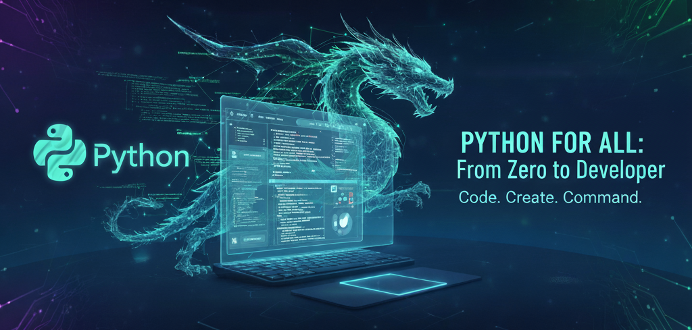

# 🐍 Python Course

Repositorio con ejemplos y ejercicios de fundamentos en **Python**.  
Actualmente enfocado en lo básico e intermedio, con intención de ir ampliando temas de forma progresiva.

<p align="center">
  
</p>

---

## ❓ Por qué seguir este curso

- 🧩 **Aprende Python desde cero:** Ideal para quienes quieren iniciarse en programación paso a paso.
- 🚀 **Curso práctico** con ejercicios resueltos para que puedas practicar lo aprendido.
- 🔓 **Código abierto:** Accede a todo el proyecto, clónalo y experimenta con él.
- 📖 **Estructura progresiva:** Desde básicos hasta conceptos intermedios.
- 💡 **Soluciones incluidas:** Cada ejercicio tiene su solución comentada.

> ⚠️ **Nota:** El curso está en desarrollo y se actualizará con nuevos contenidos regularmente.

---

## 📂 Estructura

### 🟢 **BASICS** - Conceptos Fundamentales

Archivos de teoría y ejercicios:
- `01_basic.py` - Print, tipos de datos, casting
- `01_booleans.py` - Booleanos y operadores lógicos
- `01_flow_control.py` - Condicionales, listas y bucles
- `01_functions.py` - Definición de funciones
- `02_basic.py` - Variables, tipado y f-strings
- `02_flow_control.py` - Bucles while y for avanzados
- `03_basic.py` - Input del usuario
- `03_flow_control.py` - 7 ejercicios prácticos completos

Soluciones:
- `exercises_solutions/basic_solutions.py`
- `exercises_solutions/booleans_solutions.py`
- `exercises_solutions/flow_control_solutions.py`
- `exercises_solutions/functions_solutions.py`

Documentación:
- `basics/README.md` - Guía completa del nivel

---

### 🟡 **INTERMEDIATE** - Conceptos Intermedios

Archivos de teoría y ejercicios:
- `01_dates.py` - Trabajar con fechas y horas
- `01_dictionaries.py` - Diccionarios básicos
- `01_regex.py` - Expresiones regulares parte 1
- `02_dates_exercises.py` - 5 ejercicios de fechas
- `02_dictionaries.py` - Algoritmos con diccionarios
- `02_regex.py` - Expresiones regulares parte 2
- `03_dictionaries_exercises.py` - 3 ejercicios de diccionarios
- `03_lambdas.py` - Funciones lambda
- `04_higher_order_func.py` - Funciones de orden superior y closures
- `05_exceptions.py` - Manejo de excepciones
- `06_file_handling.py` - Lectura y escritura de archivos
- `07_modules.py` - Módulos e importaciones
- `08_package_handling.py` - Entornos virtuales y pip

Soluciones:
- `intermediate_solutions/dates_solutions.py`
- `intermediate_solutions/dictionaries_solutions.py`
- `intermediate_solutions/exceptions_solutions.py`
- `intermediate_solutions/higher_order_func_solutions.py`
- `intermediate_solutions/lambdas_solutions.py`

Archivos de datos de ejemplo:
- `my_file.txt` - Ejemplo de archivo de texto
- `my_file.json` - Ejemplo de archivo JSON
- `my_file.csv` - Ejemplo de archivo CSV

Documentación:
- `intermediate/README.md` - Guía completa del nivel

---

## ✅ Contenido actual

### Nivel BASICS
- ✅ Tipos de datos y operaciones
- ✅ Booleanos y operadores lógicos
- ✅ Control de flujo (if/elif/else)
- ✅ Listas y operaciones con listas
- ✅ Funciones básicas
- ✅ Bucles (while, for)
- ✅ F-strings y formateo
- ✅ Input/output
- ✅ 7 ejercicios prácticos con soluciones

### Nivel INTERMEDIATE
- ✅ Fechas y horas (datetime)
- ✅ Diccionarios y estructuras complejas
- ✅ Expresiones regulares (regex)
- ✅ Funciones lambda
- ✅ Funciones de orden superior (map, filter, reduce)
- ✅ Closures
- ✅ Manejo de excepciones (try/except)
- ✅ Lectura/escritura de archivos (txt, JSON, CSV)
- ✅ Módulos e importaciones
- ✅ Entornos virtuales y gestión de paquetes
- ✅ Múltiples ejercicios resueltos

---

## 🛠 Requisitos

Para sacar el máximo provecho del curso necesitarás:

- **Python 3.8+**
- **Editor de código** (recomendado: Visual Studio Code)
- **Conexión a internet** para seguir las clases y ejemplos

---

## 💻 Instalación rápida

Abre tu terminal y ejecuta los siguientes comandos:

```bash
# Verifica la versión de Python
$ python --version
# En algunos sistemas puede ser:
$ python3 --version

# Clona el repositorio
$ git clone https://github.com/lgarbayo/python-course
$ cd python-course
```

---

## 🖥 Configuración del entorno

Sigue estos pasos para preparar tu entorno de desarrollo en Python:

### 1️⃣ Instala Visual Studio Code (VS Code) si aún no lo tienes
Descárgalo desde: https://code.visualstudio.com

### 2️⃣ Instala las extensiones recomendadas en VS Code
- Python
- Pylance
- Python Debugger

### 3️⃣ Ejecuta los archivos Python
```bash
# Desde la terminal de VS Code o tu terminal
python basics/01_basic.py
# O en algunos sistemas:
python3 basics/01_basic.py
```

---

## 🚀 Cómo usar este curso

### Para Principiantes

1. **Comienza con BASICS:**
   - Lee el archivo `basics/README.md` para entender la estructura
   - Ejecuta los archivos en orden: `01_basic.py`, `01_booleans.py`, etc.
   - Estudia los comentarios y ejemplos de cada archivo
   - Intenta resolver los ejercicios propuestos
   - Consulta las soluciones en `exercises_solutions/` si te atascas

2. **Cuando domines BASICS, continúa con INTERMEDIATE:**
   - Lee el archivo `intermediate/README.md`
   - Sigue el mismo patrón: teoría → ejercicios → soluciones
   - Practica con diferentes ejercicios para consolidar los conceptos

### Tips Recomendados

- 🔄 **No copies el código:** Escríbelo tú mismo para aprender
- ❓ **Experimenta:** Modifica los ejemplos y ve qué sucede
- 📝 **Toma notas:** Escribir te ayuda a retener mejor
- 🤝 **Colabora:** Comparte tus soluciones con otros
- 📚 **Consulta:** Los comentarios en el código tienen pistas

---

## 📊 Tabla de Progreso

| Nivel | Temas | Archivos | Ejercicios | Estado |
|-------|-------|----------|-----------|--------|
| 🟢 BASICS | Fundamentos | 8 | 15+ | ✅ Completo |
| 🟡 INTERMEDIATE | Estructuras avanzadas | 13 | 20+ | ✅ Completo |

> 💡 **Después de INTERMEDIATE:** Los interesados pueden aplicar sus conocimientos en proyectos personales como POO, APIs, web scraping, aplicaciones web, etc.

---

## 📚 Inspiración

<div align="center">

✨ Este curso está inspirado en el trabajo de grandes divulgadores:

[](https://github.com/midudev)
[](https://github.com/mouredev)

</div>

Se han combinado ideas y enfoques de ambos para crear un repositorio práctico y progresivo de fundamentos de Python.

---

## 🤝 Contribuciones

Si tienes sugerencias, correcciones o quieres añadir nuevo contenido:

1. Fork el repositorio
2. Crea una rama (`git checkout -b mejora/nueva-leccion`)
3. Commit tus cambios (`git commit -m 'Añado nueva lección'`)
4. Push a la rama (`git push origin mejora/nueva-leccion`)
5. Abre un Pull Request

---

## 📞 Contacto

- 🐙 GitHub: [@lgarbayo](https://github.com/lgarbayo)
- 💼 LinkedIn: [Luis Garbayo](https://linkedin.com/in/luis-garbayo)

---

## 📜 Licencia

MIT License © 2025 Luis Garbayo Fernández

---

## 🙏 Agradecimientos

Gracias a todos los que usan, comparten y contribuyen a este proyecto.  
Juntos hacemos la programación más accesible para todos.
